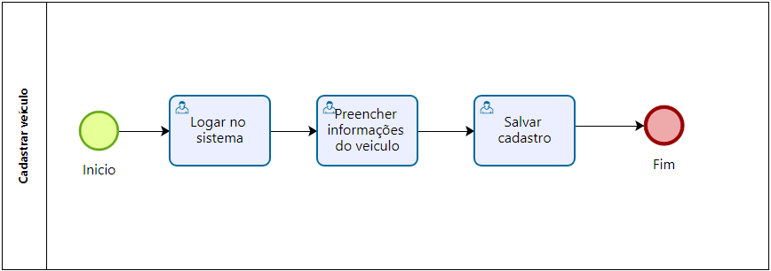
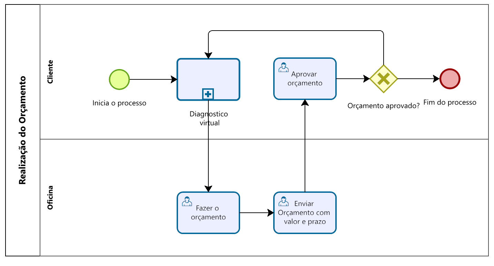
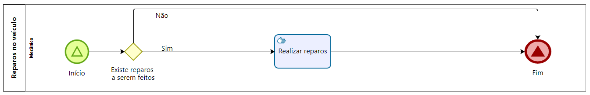
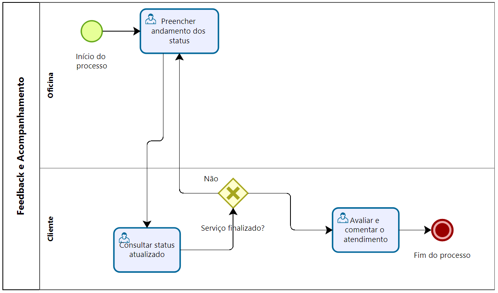

# OFICINA MECÂNICA

* Gabriel Henrique Mota Rodrigues
* Matheus Vinicius Mota Rodrigues
* Matheus Martins da Silva Porto
* Gabriel Matos Martins Fialho da Silva

---

Professores:

* Hugo Bastos de Paula
* Luiz Henrique da Costa Silva
* Danilo Boechat Seufitelli

---

_Curso de Engenharia de Software, Unidade Praça da Liberdade_

_Instituto de Informática e Ciências Exatas – Pontifícia Universidade Católica de Minas Gerais (PUC MINAS), Belo Horizonte – MG – Brasil_

---

_**Resumo**. Escrever aqui o resumo. O resumo deve contextualizar rapidamente o trabalho, descrever seu objetivo e, ao final, 
mostrar algum resultado relevante do trabalho (até 10 linhas)._

---

## 1. Introdução

Neste documento, iremos apresentar o escopo abrangente de nosso projeto, fornecendo a contextualização necessária e delineando o problema central que pretendemos abordar.

### 1.1 Contextualização

O âmbito deste trabalho está relacionado à automatização dos processos empresariais de uma oficina mecânica, englobando desde o agendamento de inspeções até a entrega final dos veículos aos clientes. Atualmente, observa-se uma considerável deficiência na gestão eficiente desses processos tanto internamente quanto nas interações com os clientes das oficinas. Segundo dados provenientes de pesquisas, é notável a recorrência de atrasos nas entregas por parte das oficinas (cerca de 17% das oficinas afirmam possuir carros parados [fonte](https://www.doutorie.com.br/blog/os-5-principais-problemas-das-oficinas-no-brasil/) ), muitas vezes sem uma comunicação transparente com o cliente a respeito dos motivos, o que resulta em significativas demoras na disponibilização dos veículos aos consumidores.

### 1.2 Problema

O nosso projeto tem como objetivo primordial solucionar a questão central da desorganização presente em oficinas, proporcionando uma comunicação mais fluida e eficiente, bem como simplificando o acompanhamento do processo de reparo automotivo pelo cliente. Atualmente, constatamos que aproximadamente 10% das oficinas enfrentam desafios relacionados à insatisfação dos clientes durante a execução dos serviços. Além disso, cerca de 20% das oficinas enfrentam dificuldades em concluir os reparos nos veículos, seja devido à falta de experiência ou à escassez de peças necessárias. 

### 1.3 Objetivo geral
Nossa iniciativa visa abordar as lacunas de comunicação e controle de estoque, promovendo uma gestão mais eficaz, reduzindo a insatisfação dos clientes pela metade e contribuindo para um aumento significativo na taxa de conclusão bem-sucedida dos reparos automotivos.

#### 1.3.1 Objetivos específicos

objetivo 1

Elaborar um sistema de cadastro de clientes e veículos que permita o armazenamento de informações detalhadas.

objetivo 2 

Permitir que os clientes pesquisem várias oficinas especializadas para ter um direcionamento na resolução do seu problema.

objetivo 3

Conectar a oficina e o cliente de forma que ambos consigam consultar os detalhamentos dos serviços.

### 1.4 Justificativas

A principal justificativa para o desenvolvimento do projeto vêm de experiências pessoais e de conhecidos dos integrantes do grupo, onde um deles teve que levar seu carro para a oficina e a cada semana tinha que ficar mandando mensagem para o mecânico para saber como estava a situação do carro.

## 2. Participantes do processo

1. Cliente:
*	Perfil: Varia amplamente em termos de idade, gênero, background cultural e nível de educação. Pode ser qualquer pessoa que possua um veículo.
*	Papel: O cliente é a parte interessada que traz o veículo para reparo. Eles interagem com o atendente de balcão para relatar problemas, aprovar orçamentos e receber orientações sobre os reparos.
  
2. Oficina:
   
*	 Perfil: Pode ter conhecimentos técnicos e habilidades de gestão, com experiência em liderar equipes e gerenciar operações.
*	 Papel: O gerente supervisiona as operações gerais da oficina. Eles revisam e aprovam orçamentos, coordenam a aquisição de peças, solucionam problemas complexos e garantem que o processo funcione sem problemas.

3. Mecânicos:
   
*	 Perfil: Têm amplo conhecimento técnico em mecânica automotiva e possuem treinamento em reparos e manutenção de veículos.
*	 Papel: Os mecânicos realizam as tarefas de reparo e substituição de peças com base nas orientações dos técnicos de diagnóstico. Eles aplicam seus conhecimentos e habilidades para restaurar o veículo às condições ideais.
  

## 3. Modelagem do processo de negócio

### 3.1. Análise da situação atual

Atualmente, o processo de busca por serviços automotivos pode ser realizado das seguintes formas:

1.Boca a Boca: Nesse modelo, o cliente que precisa de um serviço automotivo consulta seu círculo social em busca de recomendações. No entanto, essa abordagem tem limitações, pois depende da disponibilidade de amigos, conhecidos ou familiares que tenham experiência com oficinas mecânicas. Além disso, pode ser difícil encontrar alguém com a especialização necessária para o problema específico do veículo.

2.Pesquisa em Redes Sociais: Existem grupos e comunidades em redes sociais dedicados a veículos e serviços automotivos. Os usuários podem postar perguntas e obter recomendações, mas a confiabilidade das informações pode variar, e a pesquisa está restrita aos membros desses grupos.

3. Sites de Avaliação: Alguns sites oferecem avaliações de oficinas mecânicas, permitindo que os clientes compartilhem suas experiências e classifiquem os serviços. No entanto, a pesquisa ainda depende da disponibilidade de comentários para oficinas específicas.

4. Pesquisa Direta em Oficinas: Os clientes também podem pesquisar diretamente por oficinas mecânicas online, mas isso pode ser demorado e sujeito a informações limitadas.

### 3.2. Descrição geral da proposta

A proposta da AutoMech consiste em melhorar a maneira como os clientes encontram e interagem com oficinas mecânicas, eliminando as limitações do método tradicional. O fluxo da aplicação seguirá as seguintes etapas:

.Cadastro do Cliente: O cliente acessa a plataforma e cria uma conta, fornecendo informações básicas, como nome, email, senha, CPF, telefone e detalhes do veículo.

.Diagnóstico Virtual: Após o cadastro, o cliente descreve os sintomas ou problemas do veículo. Com base nessas informações, a aplicação fornece uma lista de oficinas mecânicas recomendadas.

.Solicitação de Orçamento: O cliente pode selecionar uma ou mais oficinas e solicitar um orçamento online. As oficinas recebem as informações e respondem com estimativas de preço e prazos.

.Aprovação do Orçamento: O cliente revisa as ofertas e aprova o orçamento da oficina de sua escolha.

.Reparos no Veículo: A oficina realiza os reparos necessários e atualiza o cliente sobre o progresso por meio da plataforma.

.Peças e Montagem: Se forem necessárias peças de reposição, a aplicação ajuda o cliente a encontrá-las e a oficina as instala.

.Testes e Finalização: Após os reparos, a oficina realiza testes de qualidade e segurança.

.Feedback e Acompanhamento: Após a conclusão do serviço, tanto o cliente quanto a oficina podem deixar avaliações e comentários. Isso ajuda a construir confiança e qualidade na plataforma.

A AutoMech busca proporcionar uma experiência mais eficiente e confiável para os clientes, enquanto também oferece oportunidades de crescimento para as oficinas mecânicas. As avaliações entre os usuários contribuem para um sistema de recomendação inteligente, garantindo que os clientes encontrem oficinas confiáveis com base em experiências anteriores.

### 3.3. Modelagem dos processos

[PROCESSO 1 - Cadastro do Cliente](processo-1-gerenciar-usuario.md "Detalhamento do Processo de gerenciamento do usuario.")
Neste processo, o cliente cria uma conta na plataforma AutoMech fornecendo informações pessoais e detalhes do veículo. Isso é essencial para que a plataforma possa oferecer recomendações e manter registros precisos.

[PROCESSO 2 - Cadastro de veículo](processo-7-cadastro-veiculo.md "Detalhamento do Processo 7.")
O cliente é capaz de cadastrar os veículos que possui

[PROCESSO 3 -  Diagnóstico Virtual](processo-2-diagnostico-virtual.md "Detalhamento do Processo de Diagnostco Virtual.")
Após o cadastro, o cliente descreve os problemas ou sintomas do veículo. Com base nessas informações, a plataforma gera uma lista de oficinas mecânicas recomendadas que podem lidar com o problema específico do veículo.

[PROCESSO 4 - Solicitação de Orçamento](processo-3-realizacao-do-orcamento.md "Detalhamento do Processo 3 - Realização de orçamento.")
O cliente seleciona uma ou mais oficinas da lista gerada no processo anterior e solicita orçamentos online. As oficinas recebem essas solicitações e respondem com estimativas de preço e prazos.

[PROCESSO 5 - Finalizar reparos](processo-4-reparos-veiculo.md " Reparos no veículo - Processo 4")
Nessa etapa o mecânico finaliza no sistema os reparos feitos no dia.

[PROCESSO 6 - Controle de estoque](processo-5-pecas-e-montagens.md "PROCESSO 5 - Peças e Montage")
Os funcionarios da oficina podem gerenciar os estoque de peças
)

[PROCESSO 7 - Feedback e Acompanhamento](processo-6-feedback-e-acompanhamento.md "Detalhamento do Processo 7.")
Após a conclusão do serviço, tanto o cliente quanto a oficina têm a oportunidade de deixar avaliações e comentários na plataforma. Isso ajuda a construir confiança e qualidade na comunidade AutoMech, além de contribuir para um sistema de recomendação inteligente.

## 4. Projeto da solução

O documento a seguir apresenta o detalhamento do projeto da solução. São apresentadas cinco seções que descrevem, respectivamente: diagrama de classes, diagrama de componentes, diagrama de entidade-relacionamento, tecnologias utilizadas e guias de estilo.

[Projeto da solução](solution-design.md "Detalhamento do Projeto da solução: classes, componentes, der, tecnologias e guias de estilo.")

## 5. Indicadores de desempenho

O documento a seguir apresenta os indicadores de desempenho dos processos.

[Indicadores de desempenho dos processos](performance-indicators.md)

## 6. Interface do sistema

A sessão a seguir apresenta a descrição do produto de software desenvolvido. 

[Documentação da interface do sistema](interface.md)

## 7. Testes

A sessão a seguir apresenta a descrição dos testes de unidade e testes de usabilidade realizados. 

[Testes do sistema](tests.md)

## 8. Conclusão

_Apresente aqui a conclusão do seu trabalho. Discussão dos resultados obtidos no trabalho, onde se verifica as observações pessoais de cada aluno. Poderá também apresentar sugestões de novas linhas de estudo._

# REFERÊNCIAS

**[1.1]** - _ELMASRI, Ramez; NAVATHE, Sham. **Sistemas de banco de dados**. 7. ed. São Paulo: Pearson, c2019. E-book. ISBN 9788543025001._

# APÊNDICES

## Apêndice A - Código fonte

[Código do front-end](../src/BackendTIS) -- repositório do código do front-end

[Código do back-end](../src/FontendTIS)  -- repositório do código do back-end

## Apêndice B - Apresentação final

[Slides da apresentação final](../assets/apresententacoes/AutoMech-ApresentaçãoFinal.pdf)

[Vídeo da apresentação final](video/arquivo.mp4)

