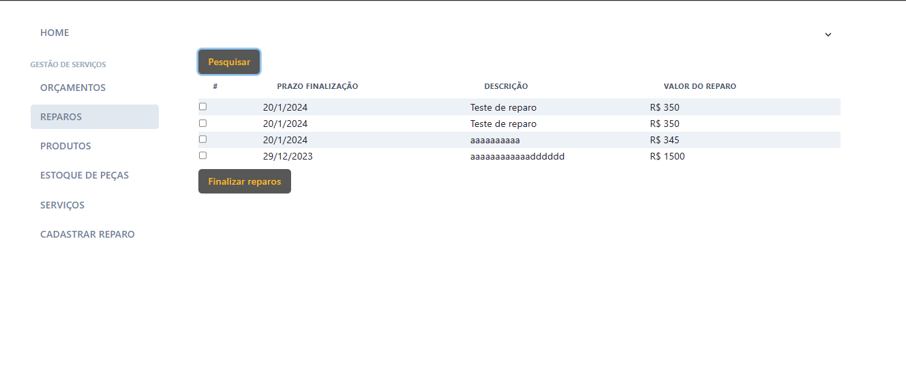

## 6. Interface do sistema

Visão geral da interação do usuário pelas telas do sistema. Apresente as principais interfaces da plataforma. 

Primeira link com o site no servidor da Vercel

https://auto-mech-site.vercel.app/home

Repositório da aplicação: https://github.com/gabrielmatosmartins/AutoMechSite

## 6.1. Telas do processo 1

Descrição da tela relativa à atividade 1 - Cadastrar no sistema.

Descrição da tela relativa à atividade 2 - Login na plataforma.

Descrição da tela relativa à atividade 3 - Alterar cadastro.

## 6.1. Telas do processo 2

Descrição da tela relativa à atividade 1 - Descrever problemas.

## 3.1. Telas do processo 3

Descrição da tela relativa à atividade 1 - Selecionar a Oficina.

Descrição da tela relativa à atividade 2 - Solictar o orçamento da oficina.

Descrição da tela relativa à atividade 3 - Fazer o orçamento.

Descrição da tela relativa à atividade 4 - Enviar o orçamento com valor e prazo.

Descrição da tela relativa à atividade 5 - Revisar orçamentos feito pela Automech.

Descrição da tela relativa à atividade 6 - Aprovar orçamentos.

## Telas do processo 4

Descrição da tela relativa à atividade 1 - Finalizar reparos.

## 7.1. Telas do processo 7

Descrição da tela relativa à atividade 1 - Cadastrar veiculo.

