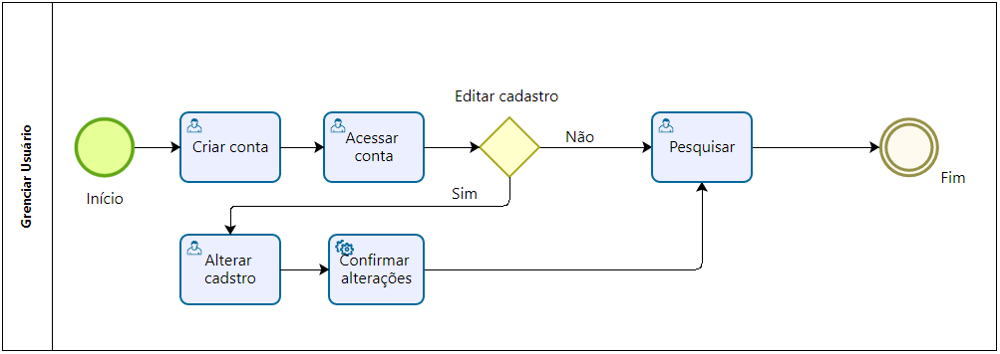

### 3.3.1 Processo 1 – Gerenciar usuário

Primeiramente, é necessário fazer o cadastro do cliente. Para esse processo
é necessário saber o CPF, nome, telefone para contato e endereço. Se todos 
os campos forem preenchidos de maneira correta e sem duplicidades, um novo 
cliente está cadastrado

#### Detalhamento das atividades

O cliente acessa o site da Automech querendo buscar uma oficina, para recomendarmos uma,
precisamos saber primeiro se o cliente já possui cadastro no sistema. Caso a resposta seja
negativa, ele deve criar um cadastro obedecendo os campos necessários e as devidas restrições.

Após a criação da conta o cliente tem a opção de editar as informações cadastradas

**Criar conta**

| **Campo**       | **Tipo**         | **Restrições** | **Valor default** |
| ---             | ---              | ---            | ---               |
| nome            | Caixa de Texto   | mínimo de 4 caracteres |           |
| cpf             | Caixa de Texto   | 11 caracteres  |                   |
| email             | Caixa de Texto   | Ser um email  |                   |
| senha             | Caixa de Texto   | mínimo de 8 caracteres  |                   |
| confirmar senha             | Caixa de Texto   | igual ao campo senha  |                   |
| endereço        | Caixa de Texto   | mínimo de 8 caracteres |           |
| número          | Caixa de Texto   | mínimo de 1 caracter |             |

| **Comandos**         |  **Destino**                   | **Tipo** |
| ---                  | ---                            | ---               |
| cadastrar            | Tela de login  |                   |

**Acessar conta**

| **Campo**       | **Tipo**         | **Restrições** | **Valor default** |
| ---             | ---              | ---            | ---               |
| email             | Caixa de Texto   | ser um email valido  |                   |
| senha             | Caixa de Texto   | mínimo de 8 caracteres  |                   |

| **Comandos**         |  **Destino**                   | **Tipo** |
| ---                  | ---                            | ---               |
| logar            | Tela inicial  |                   |
| cadastrar            | Tela de cadastro  |                   |

**Alterar dados**

| **Campo**       | **Tipo**         | **Restrições** | **Valor default** |
| ---             | ---              | ---            | ---               |
| nome            | Caixa de Texto   | mínimo de 4 caracteres |           |
| senha             | Caixa de Texto   | mínimo de 8 caracteres  |                   |
| confirmar senha             | Caixa de Texto   | igual ao campo senha  |                   |
| endereço        | Caixa de Texto   | mínimo de 8 caracteres |           |
| número          | Caixa de Texto   | mínimo de 1 caracter |             |

| **Comandos**         |  **Destino**                   | **Tipo** |
| ---                  | ---                            | ---               |
| confirmar            | Tela de usuário  |                   |

