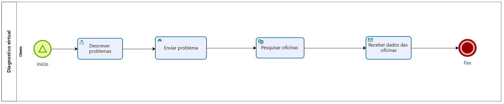

### 3.3.2 Processo 2 – Diagnostico Virtual

O mecânico realiza o diagnóstico virtualmente. 

#### Detalhamento das atividades

Nessa etapa, o cliente envia para o sistema um resumo dos problemas no seu veículo e após isso, o sistema retorna uma lista de oficinas especializadas.

**Descrever problemas:** Aqui o cliente descreve o problema no seu veículo para procurar uma oficina especializada.

| **Campo**       | **Tipo**         | **Restrições** | **Valor default** |
| ---             | ---              | ---            | ---               |
| Descrição do problema  | Área de Texto   | - |    Vazio      |

| **Comandos**         |  **Destino**                   | **Tipo** |
| ---                  | ---                            | ---               |
| Pesquisar oficinas especializadas | Página de pesquisa com o retorno das oficinas especializadas no problema enviado  |                   |
| Pesquisar oficinas | Página de pesquisa com o retorno das oficinas cadastradas no sistema  |                   |

**Receber dados das oficinas:** Aqui o cliente recebe as oficinas baseado na descrição que ele fez do veículo.

| **Campo**       | **Tipo**         | **Restrições** | **Valor default** |
| ---             | ---              | ---            | ---               |
| Oficinas  | Seleção   | Apenas uma por vez |    Vazio      |

| **Comandos**         |  **Destino**                   | **Tipo** |
| ---                  | ---                            | ---               |
| Ver oficina | Página de detalhes da oficina  |                   |

