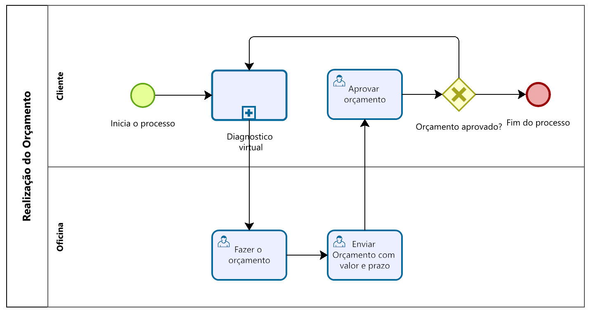

### 3.3.3 Processo 3 –   Realização do orçamento

Este processo gera um orçamento com prazo e valor estipulado

#### Detalhamento das atividades

Nesta atividade o cliente seleciona a oficina solicita o orçamento.
A oficina gera o orçamento e envia para o cliente o orçamento com preço e prazo.

**Faz orçamento** 
* Aqui a oficina faz o orçametno para o cliente do preço dos serviços e envia ao cliente. 

| **Campo**         |  **tipo**                   | **Restriçoes** | **Valor default**|
| ---                  | ---                      | ---            | -------          |
| Status  | String  | Está na dentro da lista de Status | Pendente |
| Data e hora  | Data Hora |  dd-mm-aaaa e hh:mm:ss       |  Hora do sistema   |
| Serviço  | String | 100 caracteres     |   |
| Nome do cliente | String | 30 caracteres     |   |
| Valor| Moeda | Formato R$ 0,00     |   |

| **Comandos**       | **Destino**         | **tipo** |
| ---             | ---              | ---      |
|Fazer orçamento        | Formulário de edição   |  Botão     |
| Editar         | Formulário de edição   |  Botão     |
| Exluir       | nenhum  |  Botão     |

**Enviar Orçamento com valor e prazo** 
* Aqui a oficina faz o orçametno para o cliente do preço dos serviços e envia ao cliente. 

| **Campo**         |  **tipo**                   | **Restriçoes** | **Valor default**|
| ---                  | ---                      | ---            | -------          |
| Formulário de edição do orçamento  | Formulário | Edições de campos válidos do formulário obigatório|      |
| Prazo | String  | Está na dentro da lista de Prazo |3 dias|
| Quantidade de peças | Numérico  | Nenhum |0|
| Status  | String  | Está na dentro da lista de Status | Pendente |
| Data e hora  | Data Hora |  dd-mm-aaaa e hh:mm:ss       |  Hora do sistema   |
| Serviço  | String | 100 caracteres     |   |
| Descrição do serviço  | String | 500 caracteres     |   |
| Nome do cliente | String | 30 caracteres     |   |
| Valor| Moeda | Formato R$ 0,00     |   |

| **Comandos**       | **Destino**         | **tipo** |
| ---             | ---              | ---      |
|Concluir       | Retorna para tabela   |  Botão     |

**Aprovar orçamentos**  

* A tela apresenta um botão de aprovar e reprovar o orçamento com a forma resumida do orçamento

| **Campo**       | **Tipo**         | **Restrições** | **Valor default** |
| ---             | ---              | ---            | ---               |
| Status  | String  | Está na dentro da lista de Status | Pendente |
| Data e hora  | Data Hora |  dd-mm-aaaa e hh:mm:ss       |  Hora do sistema   |
| Serviço  | String | 100 caracteres     |   |
| Valor Final     | Moeda  | Valor em reais |        R$0,00        |

| **Comandos**       | **Destino**         | **tipo** |
| ---             | ---              | ---            |
| Aprovar       | Fim do processo 4/ tela de serviço iniciado | Accept |
| Reprovar      | Tela inicial de orçamentos | Cancel |

