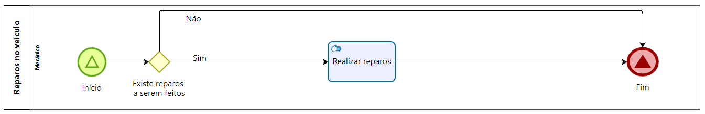

### 3.3.4 Processo 4 – Reparos no veículo

#### Detalhamento das atividades

Neste processo, o mecânico finaliza no sistema os reparos que ele realizou no dia.

**Realizar reparos**

| **Campo**       | **Tipo**         | **Restrições** | **Valor default** |
| ---             | ---              | ---            | ---               |
| Reparos   | Número   |  ---  |      -     |

| **Comandos**         |  **Destino**                   | **Tipo** |
| ---                  | ---                            | --- |
| Finalizar reparo | "" | - |
