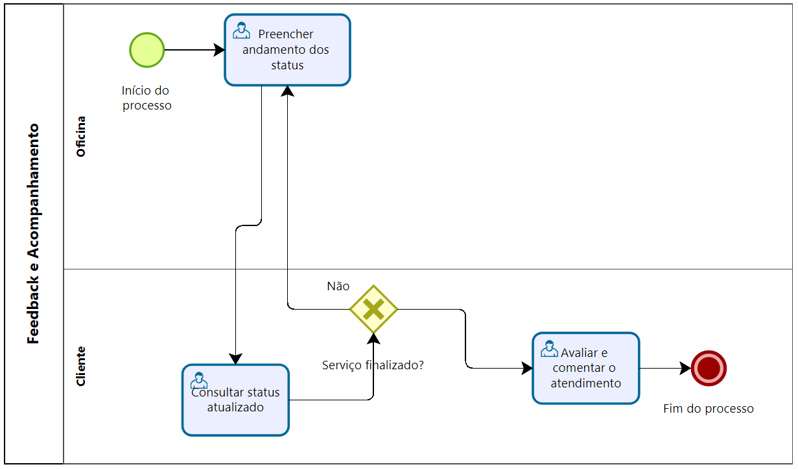

### 3.3.6 Processo 6 – Processo de Feedback e Acompanhamento

No processo final foi identificado a necessidade de melhoria na atualização do Status de Acompanhamento. Além disso o Feedback é importante para indentificar novas melhorias.

#### Detalhamento das atividades

Após a conclusão do serviço, tanto o cliente quanto a oficina têm a oportunidade de deixar avaliações e comentários na plataforma. Isso ajuda a construir confiança e qualidade na comunidade AutoMech, além de contribuir para um sistema de recomendação inteligente. Para ter um feedback os clientes deve fazer suas avaliações para possíveis melhorias no processo e a oficina deve dar o retorno do atendimento, de forma que o cliente consiga acompanhar o processo. 

**Preencher andamento dos status**

* Os responsáveis pela manutenção na oficina preenchem o Status do serviço

| **Campo**       | **Tipo**         | **Restrições** | **Valor default** |
| ---             | ---              | ---            | ---               |
| Status  | String  | Está na dentro da lista de Status | Pendente |
| Serviço  | String | 100 caracteres     |   |
| Descrição do serviço  | String | 500 caracteres     |   |
| Valor| Moeda | Formato R$ 0,00     |   |

| **Comandos**       | **Destino**         | **tipo** |
| ---             | ---              | ---            |
| Salvar | Tela de consulta como o cliente consulta  | Submit           |

**Consultar status atualizado**

* Nessa tela o cliente consulta com detalhe o andamento do seu carro

| **Campo**       | **Tipo**         | **Restrições** | **Valor default** |
| ---             | ---              | ---            | ---               |
| Staus | Valores com Status  |        |                   |
| Serviço realizado | Serviço        |           |                |

| **Comandos**       | **Destino**         | **tipo** |
| ---             | ---              | ---            |
| Atualizar | Página de consulta atualizada   | Update            |

**Avaliar e comentar o atendimento**

* Tela de avaliação dos serviços

| **Campo**       | **Tipo**         | **Restrições** | **Valor default** |
| ---             | ---              | ---            | ---               |
| Seleção de estrelas        | checkbox  | máximo 5 estrelas  |                |
|Comentário sobre a experiência | Área de texto               | máximo de  100 caracteres           |                   |

| **Comandos**       | **Destino**         | **tipo** |
| ---             | ---              | ---            |
| Enviar | Tela de comentários | Button |  

