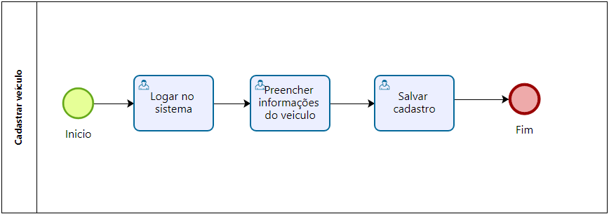

### 3.3.7 Processo 7 – Processo de Cadastro de veículo

No processo de cadastro de veiculo o cliente é capaz de cadastrar os veiculo que possui dentro do sistema.

#### Detalhamento das atividades

Após logar no sistema, o cliente precisa cadastrar os veículo para poder realizar orçamentos, para isso ele pode acessar o menu "carros" e cadastrar um novo

**Preencher dados do veículo**

* O cliente preenche os dados do veículo

| **Campo**       | **Tipo**         | **Restrições** | **Valor default** |
| ---             | ---              | ---            | ---               |
| Marca  | String  | Não ser nulo | nulo |
| Modelo  | String | Não ser nulo     | nulo  |
| Placa  | String | 7 caracteres     |  nulo |
| Ano| Inteiro | 92 ou 1992     |  nulo |

| **Comandos**       | **Destino**         | **tipo** |
| ---             | ---              | ---            |
| Salvar | Mesma tela com a tabela de veiculos atualizada  | Submit     |

