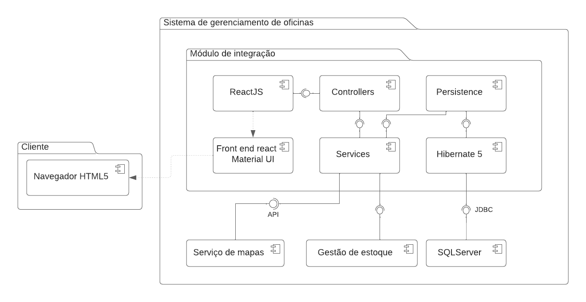
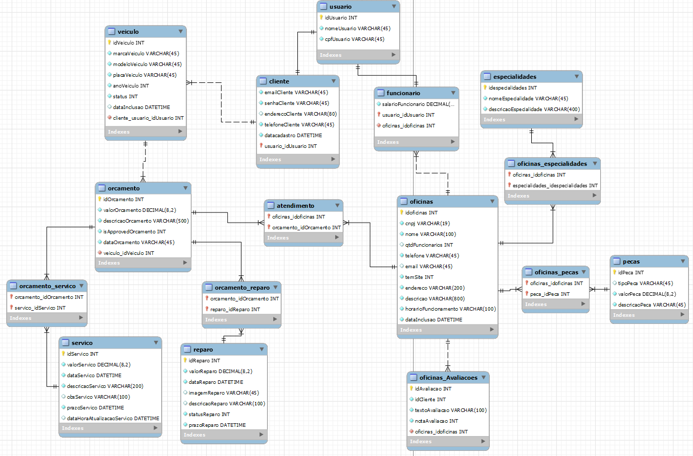
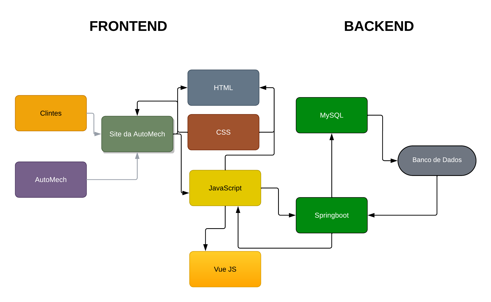
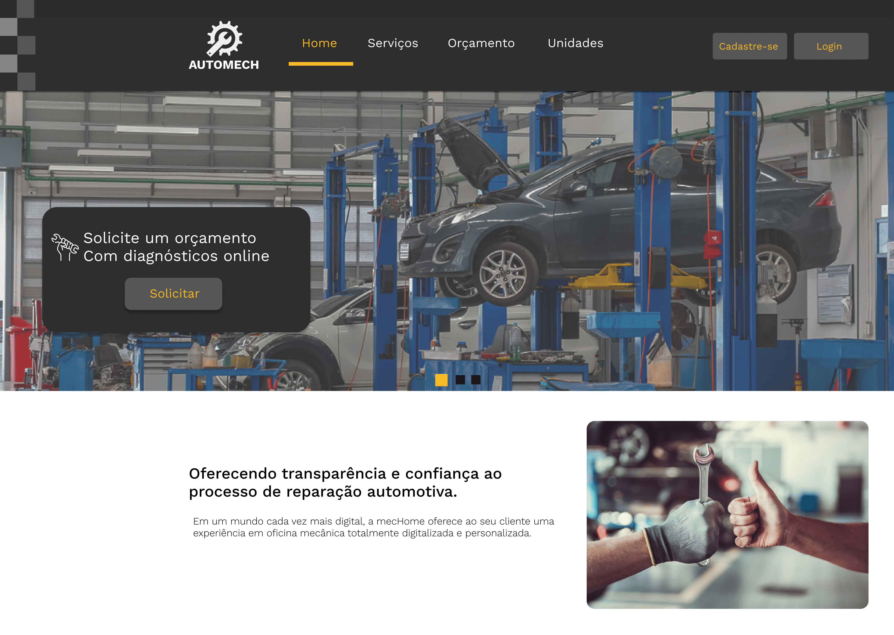
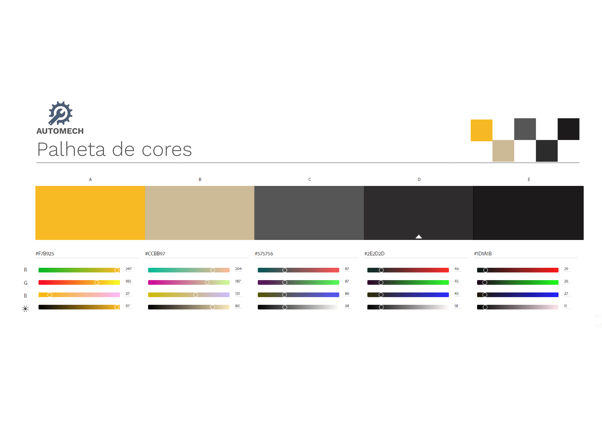
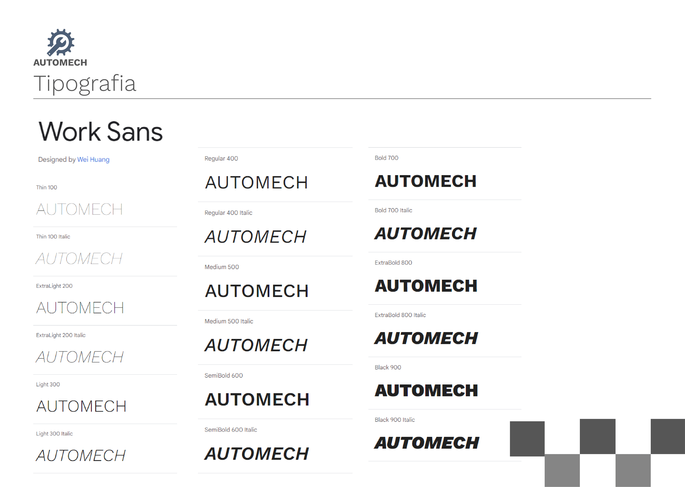
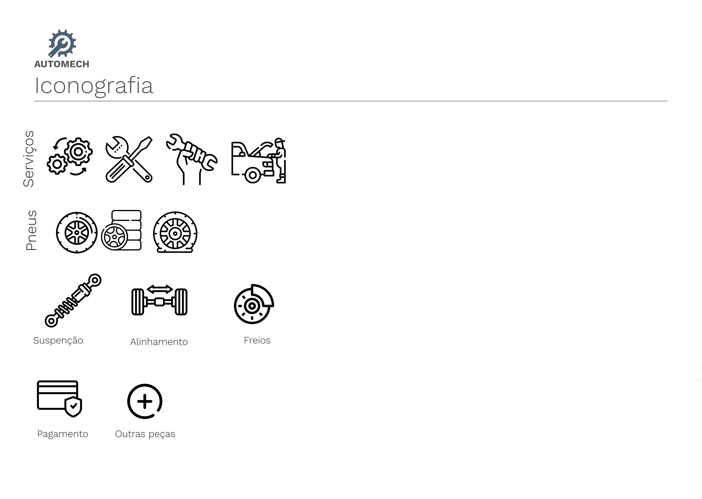

## 4. Projeto da solução

### 4.1. Diagrama de classes (Atualizado)

![Diagrama de Classes ]

### 4.2. Diagrama de componentes

Conforme diagrama apresentado, as entidades participantes da solução são:

- **Navegador HTML5** - A porta de acesso para o nosso sistema, sera a base para a visualização de todas as telas
- **Serviço de mapas** - Utilização da API de mapas fornecida pelo Google para mostrar a ocaização das oficinas cadastradas
- **Gestão de estoque** - O serviço sera utilizado para fazer a gestão do estoque de peças que a oficina possui para evitar a falta de peças essenciais para serviços mais rotineiros
- **SQLServer** - SGBD utilizado para fazer a implementação do banco de dados
- **Hibernate5** - Sera utilizado para facilitar o mapeamento entidade-relacional das entidades utilizadas no projeto
- **ReactJS** - Sera utilizado para a criação das interfaces de usuário

### 4.3. Modelo de dados

**Modelo de dados**

### 4.4. Tecnologias

As tecnologias que serão utilizadas para resolução do problema são:

| **Tecnologia ou ferramenta**   | **Utilização**  |
| ---            | ---             |
| Visual Studio Code | IDE utilizada para edição de código      |
| GitHub      | 	Versionamento dos arquivos em repositório remoto    |
| Figma    | Plataforma de design gráfico para fazer a prototipagem do site       |
| Photoshop  | 	Utilizado para o design do Style Guide       | 
| FontAwesome  | 	Ferramente utilizada para a estilização de fontes e ícones      | 
| HTML    | Linguagem de marcação utilizada  |
| CSS    | Linguagem de estilização utilizada|
| JavaScript | Linguagem de programação utilizada para manipular elementos da pagina da aplicação         |
| Java | Linguagem de programação utilizada para codificar o back-end         |
| Vue JS | Framework front-end para fazer requisições da API e apresenta-las no navegador         |
| Spring Boot         | Framework back-end utilizado para criar e gerenciar as entidades em um banco de dados          |
| MySQL Workbench     | Ferramenta de modelagem relacional       |
| Postman    | Teste para enviar solicitações HTTP para APIs e visualizar as respostas     |
| HeideSQL     | Software utilizado para visualizar o banco de dados criado       |
| Azure        | 	Serviço que permite a computação remota   |
| Amazon AWS | 	Serviço para hostear o banco de dados   |

Abaixo esté a arquitetura de data flow da aplicação web.

### 4.5. Guias de estilo

Layout padrão do site (HTML e CSS) que será utilizado em todas as páginas com a definição de identidade visual, aspectos de responsividade e iconografia.

Explique as guias de estilo utilizadas no seu projeto.

## Design

Para o layot vamos utilizar o seguinte modelo de estilização.

## Cores

A Palheta de cores com código Hex utilizada foram as coisa abaixo.

## Tipografia

As fonte utilizada para o projeto foi a família Work Sans.

 **Título de página: SemiBold 600**

 **Título de seção: Medium 500**
 
 **Rótulos de componentes: Recular 400**
 
 **Corpo de Texto: Light 300**

 

## Iconografia

Os icones utilizados como base são os icones abaixo.

Para a aplicação dos icones no site vão ser utilizados o css FontAwesome.

 
